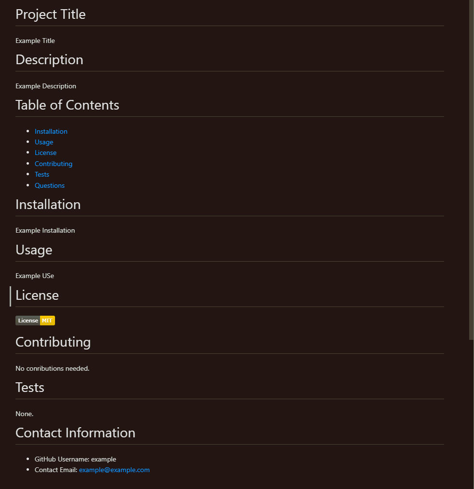

  # README-Generator
  
  # Description
  Uses node js to provide a command-linae application allowing the user to input information with which to fill in a pre-formatted README file

  # Table of Contents 
  * [Installation](#-Installation)
  * [Usage](#-Usage)
  * [License](#-Installation)
  * [Contributing](#-Contributing)
  * [Tests](#-Tests)
  * [Questions](#-Contact-Information)
      
  # Installation
  Clone the repository, then run `npm install`

  # Usage
  Run `node index.js within the root folder. Answer all the resulting questions according to your needs for a custom README

  # Demonstration of App in Action
  

  ## Picture of the resulting README
  

  # License 
  

  # Contributing 
  This project is complete.

  # Tests
  None.

  # Contact Information 
  * GitHub Username: a-ens
  * Contact Email: andrewjensor@gmail.com
  